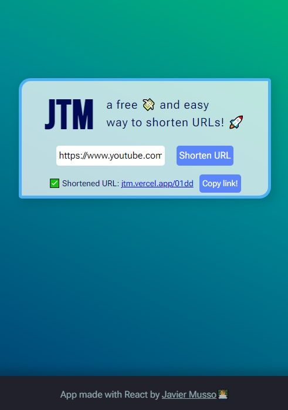
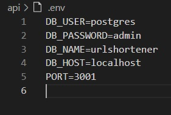

<h1>URL Shortener ✂</h1>
<h3>Small project I made in a few hours for fun.</h3>
<h2 align="center"><a href='https://jtm.vercel.app/'>Try out the live demo!</a></h2>

It's done with React, Express, Sequelize and PostgreSQL.  For css I used Sass and CSS Modules.

- React 18
- Express 4.17
- PostgreSQL 14
- Sequelize 6.3

To run the app, you need to create a postgreSQL DB.  
Configure .env file with your own variables. 
  
Then, run 'npm i' on both client and api folders.  
Once that's finished, 'npm run' on the same both directories.

